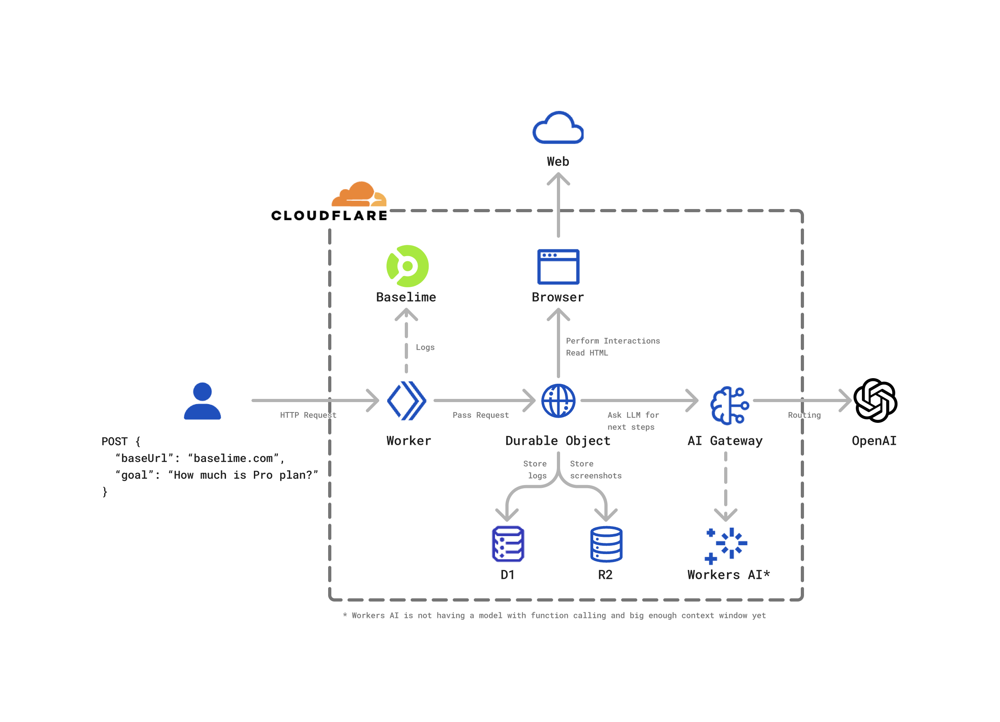

# AI-Controlled Browser on Cloudflare

This is an experiment to create an AI Agent that can crawl and interact with webpages to achieve desired goal. Fully on Cloudflare (almost).

Services used:

- [Cloudflare Workers](https://developers.cloudflare.com/workers/) - responding to HTTP requests
- [Cloudflare Durable Objects](https://developers.cloudflare.com/durable-objects/) - running agent's core loop
- [Cloudflare Browser Rendering](https://developers.cloudflare.com/browser-rendering/) - programmatically control a web browser
- [Cloudflare AI Gateway](https://developers.cloudflare.com/ai-gateway/) - monitor requests to OpenAI (to be replaced with Workers AI 🤞, all we need is a model with bigger context window and function calling)
- [Cloudflare R2](https://developers.cloudflare.com/r2/) - store screenshots of the interactions
- [Baselime (acquired by Cloudflare)](https://baselime.io/) - tracing using OpenTelemetry & logging



## Usage

```sh
pnpm i
npx wrangler secret put OPENAI_API_KEY # and fill with your OpenAI key
# You can also put it inside .dev.vars
pnpm run deploy # You can use `pnpm run dev` as well but Browser Rendering does not work locally
curl -X POST \
  <URL to your deployed worker> \
  -d '{"baseUrl": "https://asana.com", "goal": "Extract pricing data" }' # Replace with your URL and goal
```

### The loop

1. User sends request to the Cloudflare Worker
2. Cloudflare Worker passes that to the Durable Object
3. Durable Object starts or reuses Browser and loads `baseUrl` from the request's body
4. The Goal and HTML is passed via AI Gateway to the LLM. LLM Responds with:

- Either the goal is met and final answer is returned
- Or LLM decides to do one of three things:
  - Click something on the page
  - Type something
  - Select something

5. After each interaction, the current browser window screenshot is stored in R2. The resulting HTML (or error) is passed to the LLM to generate next step (back to 4).

### Limitations

- To prevent huge bills, Cloudflare Worker is capped at 2 requests per 10 seconds (adjustable in `wrangler.toml`)
- GPT-4o context window allows up to 128K tokens. HTML code of many pages exceeeds that
- Browser Rendering session is limited to 180 seconds (can be changed in code though by adjusting `KEEP_BROWSER_ALIVE_IN_SECONDS`)
